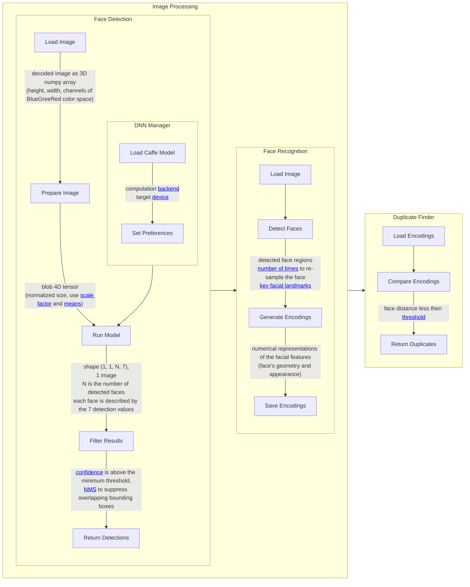

---
tags:
  - Deduplication
---

# Image Processing and Duplicate Detection

The workflow uses pre-trained models from [OpenCV](https://opencv.org/) for face detection and [dlib](http://dlib.net/) for face recognition and landmark detection. This setup provides a fast, reliable solution for real-time applications, without requiring the training of models from scratch. OpenCV handles face detection using a Caffe-based model, while **dlib**, accessed through the [face_recognition](https://pypi.org/project/face-recognition/) library, manages recognition and duplicate identification.

Future updates will involve custom-trained models to further improve performance.

## Inference Mode Operation

This application operates entirely in inference mode, relying on pre-trained models for both face detection and recognition tasks. **OpenCV** handles face detection, and **face_recognition**, a Python wrapper for **dlib**, performs face recognition and duplicate identification. This approach ensures efficient, real-time processing without the need for additional training, allowing the application to quickly deploy its capabilities.

- **OpenCV**: Optimized for fast face detection, ideal for real-time image and video applications.
- **dlib's face_recognition**: Focuses on generating face embeddings for comparison, providing high accuracy in identification.

By combining OpenCV for detection and dlib for recognition, the system offers a balance of speed and precision.

### Pre-Trained Models Storage

- **OpenCV** uses a pre-trained [Caffe model](https://caffe.berkeleyvision.org/) stored in Azure Blob Storage, automatically downloaded at application startup.
- **face_recognition** utilizes a pre-trained [dlib model](https://pypi.org/project/face_recognition_models/) stored locally within the container’s library directory.

Administrators can manually update the **Caffe model** via the admin panel, allowing flexible updates or new model versions without altering the application code.

---

## Face Detection and Recognition Models

### OpenCV Model Details

OpenCV powers the face detection component using a pre-trained model designed for real-time performance.

#### Model Components

- **deploy.prototxt**: Defines the network architecture and parameters for model execution.
- **res10_300x300_ssd_iter_140000.caffemodel**: Contains trained weights, generated after 140,000 iterations using the **Caffe** framework.

#### Model Architecture

- **Res10 Architecture**: A lightweight model that balances speed and accuracy, perfect for real-time detection.
- **300x300 Input Resolution**: Optimized for face detection at this resolution, ensuring a balance between detail and efficiency.
- **SSD (Single Shot MultiBox Detector)**: A method that predicts bounding boxes and confidence scores in a single pass, allowing rapid detection of multiple faces in a single image.

### Dlib Model Details

The **dlib** models used for recognition and facial landmark detection include:

1. **dlib_face_recognition_resnet_model_v1.dat**

    A modified **ResNet-34** model generating **128-dimensional face embeddings** for face recognition, achieving **99.38% accuracy** on the LFW benchmark.

2. **mmod_human_face_detector.dat**
    A **CNN-based Max-Margin Object Detector (MMOD)** for accurate face detection, especially under difficult conditions like varied orientations or lighting.

3. **shape_predictor_5_face_landmarks.dat**
    Detects **5 key facial landmarks** (eye corners and nose base), optimized for fast face alignment.

4. **shape_predictor_68_face_landmarks.dat**
    Detects **68 facial landmarks** (eyes, nose, mouth, jawline), used for more detailed facial alignment and analysis.

---

## Workflow Diagram

The workflow diagram illustrates the overall process of image processing and duplicate detection. **OpenCV** is used for face detection, while **face_recognition** (built on **dlib**) handles face recognition and duplicate identification.

