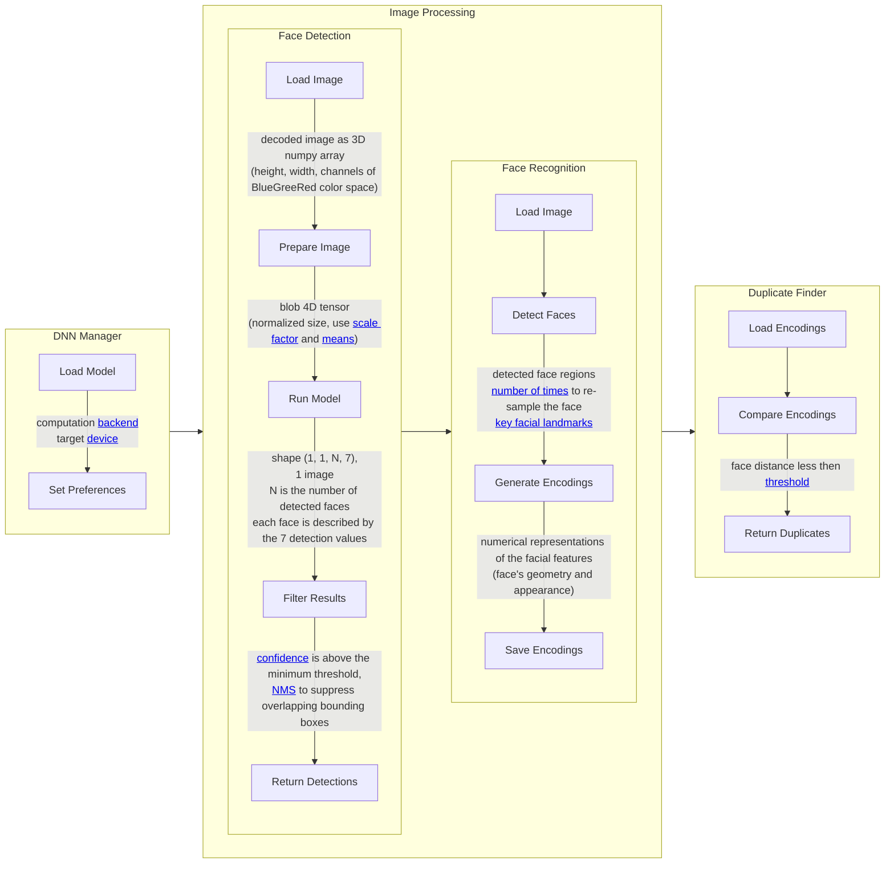

The Image Processing and Duplicate Detection workflow is designed to provide reliable face detection, recognition, and duplicate detection by leveraging a pre-trained deep learning model.

## Inference Mode Operation

This application operates strictly in inference mode, which means that it does not perform training but instead relies on a pre-trained model for face recognition tasks. This mode ensures that the application can rapidly deploy face recognition capabilities without the computational cost or time required for training models from scratch.

### Pre-Trained Model Usage.

The pre-trained model is stored in Azure Blob Storage and is automatically downloaded by the application when it starts. This process ensures that the latest version of the model is always available for inference.
### Manual Model Update.

In addition to automatic loading, administrators have the option to manually update the model through the admin panel. This feature provides flexibility for applying updates or new models when improvements or changes are required without modifying the underlying code.

## Model Details

The face recognition capabilities are powered by the [OpenCV](https://github.com/opencv/opencv) library. Currently, the application utilizes an open-source, pre-trained model specifically designed for face detection.

### Model Components

- **deploy.prototxt**: This file defines the model architecture, including the network layers and the specific parameters used for each layer. It serves as a blueprint that guides how the model processes input data.
- **res10_300x300_ssd_iter_140000.caffemodel**: This file contains the trained weights of the model. It was trained using the **Caffe** deep learning framework, with a total of 140,000 iterations, ensuring robustness in face detection tasks.

### Model Architecture

- The model follows the **Res10** architecture, which is known for its efficiency in detecting faces. Res10 is a lightweight model that balances speed and accuracy, making it suitable for real-time applications.
- The model operates with a fixed input resolution of **300x300**, optimizing detection for faces within that scale. This resolution offers a compromise between detail and processing efficiency, allowing the model to quickly identify facial features without excessive computational load.
- SSD Methodology. The model utilizes the **Single Shot MultiBox Detector (SSD)** methodology, which is a popular approach for object detection. SSD is designed to predict both the bounding boxes and the confidence scores for each object in a single forward pass through the network. By leveraging the SSD approach, the model can efficiently detect multiple faces in a single image, making it suitable for batch processing and applications where rapid detection is required.

## Worklow Diagram

The workflow diagram illustrates the overall process of Image Processing and Duplicate Detection within the system, showcasing how different components interact to achieve **face detection**, **recognition**, and **duplicate identification**. 

