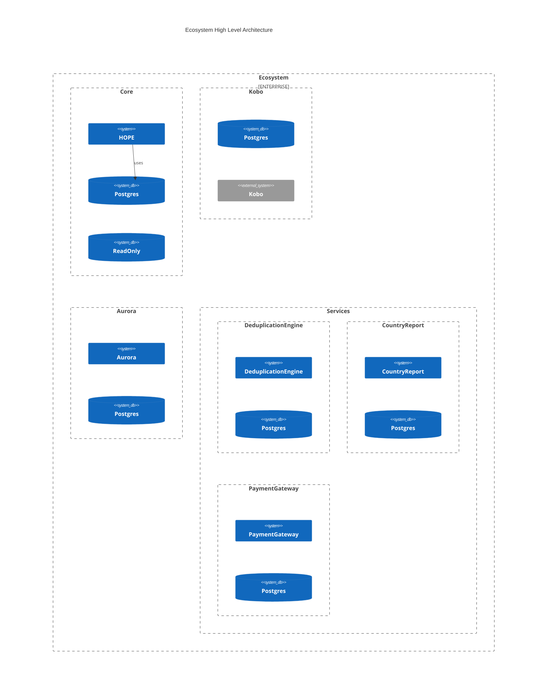

# Ecosystem components

HOPE is designed with a modular architecture, giving users the flexibility to customize and extend the platform according to their unique needs. It’s built to be scalable, adaptable, and interoperable, making it simple to integrate with other systems and platforms, ensuring smooth workflows and easy expansion as your needs grow.

The source code for HOPE is fully open-source and available for anyone to explore, contribute to, or customize. Our codebase is hosted on GitHub, making it easy to access, review, and collaborate on.

- [HOPE](hope/index.md)
- [Aurora](components/aurora.md)
- [Kobo](components/kobo.md)
- [Payment Gateway](pg/index.md)
- [Deduplication Engine](components/hde.md)
- [Country Report](components/reporting.md)
- [Country Workspace] _work in progress_
