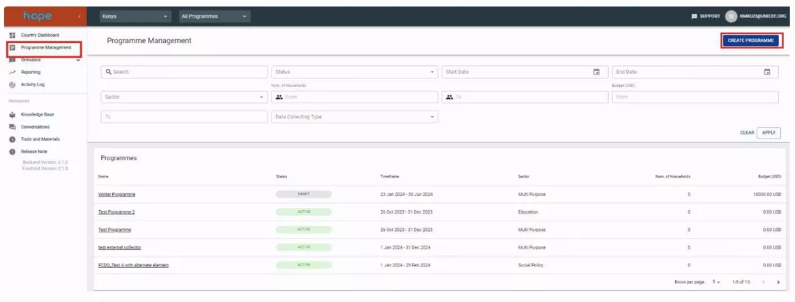
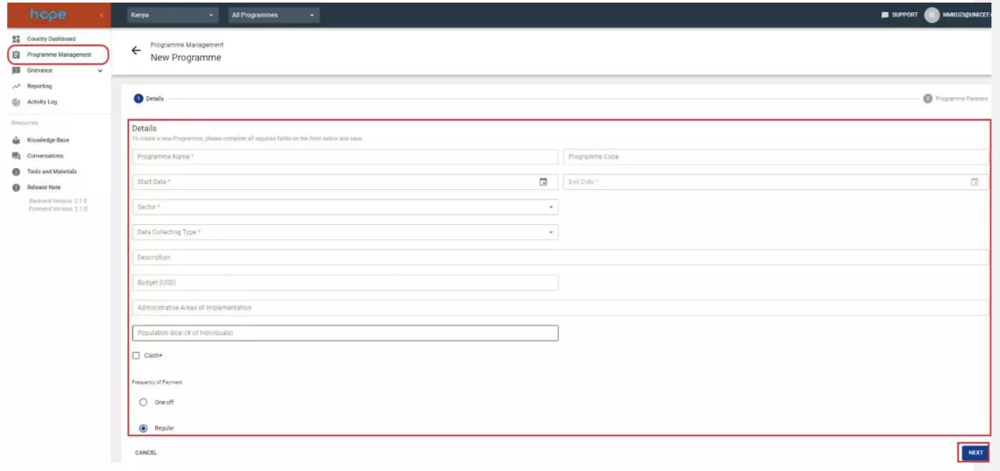
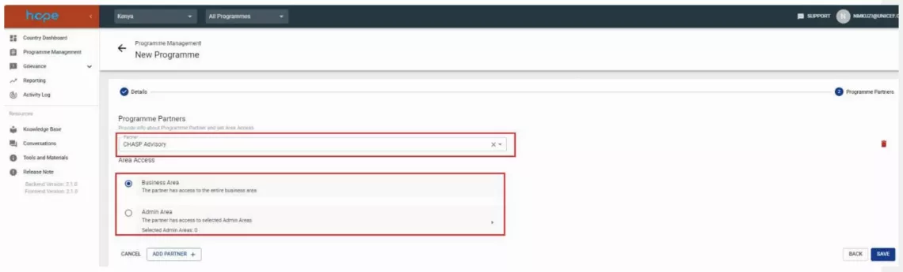
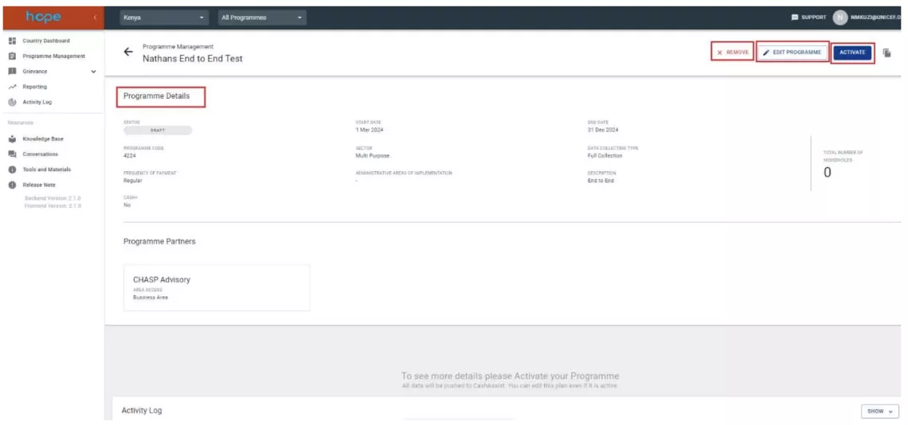
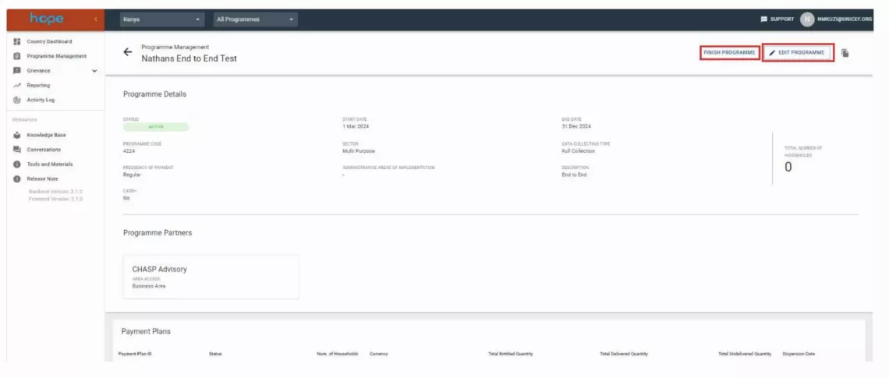

# Program 

The Programme Management module is used for defining objectives and basic programme information to be matched with assistance records for reporting purposes. This module involves defining the framework within which all aspects of a humanitarian cash transfer can be created and managed. Creating a programme involves defining a programme name, code, duration, sector, scope, description, geographical area of implementation and frequency of payment. The Programme set up process also includes a step to assign Partners to the Programme. This step is optional and should only be used by country offices willing to “segregate” the view of partners or UNICEF sections to PII of a given programme (commonly referred to as Ringfencing). In this area Partner access can be restricted further by administrative areas. In case no ringfencing is required Partners would be assigned access to the whole business area.

####  Why is Programme Management Important? 

Creating a programme in HOPE is the first step towards delivering assistance to beneficiaries in the form of interventions.

What Do I Need to Do Before Creating a Programme in Hope? 

- Make sure the programme name is unique. 
- Make sure the start and end date are correct. 
- Know the allocated budget amount for the programme.
- Make sure your are familiar with the concept of programme data collection type

## How to setup a new Programme

#### Start 

Select the ‘Programme Management’ tab in the legend, then select ‘Create Programme’

#### Provides infos

Fill in the required fields for the new Programme.

!!! note 

    The data collection type parameter defines the structure of beneficiary data used in the Programme. 

1. Full Collection: Full individual data is collected. This type indicates that data has been collected for all of the household members. (Individuals with details collected = size of household).
1. Partial Individuals: Partial individual data collected. This type indicates that data has been collected for the Head of Household, collector, and at least one other individual. However, data collection has not covered every member of the household. (Individuals with details collected are less than the size of household).
1. Size only: Size only collected This type is assigned when only the size of the household (count of individuals) has been collected without collecting specific details about the household members.
1. Size/age/gender disaggregated: No individual data available. This data collection type is assigned when no data has been collected for any individual other than the head of the household.
1. Frontline Worker: This type is used for population where only individual information is collected to pay incentives for workers, and it can be named by the section implementing the programme. 

#### Configure Partners

Upon clicking “Next”, the programme partners page will appear where you can select a programme partner from a drop-down list and grant access to the entire business area or limit access by administrative areas. Users are also able to assign more than one partner to a programme.

#### Complete setup

After clicking the save button, a page with the summary of the programme details will be displayed. 

Three actions can occur in the Programme Details page: 

1. To activate the programme, click on the activate button.
1. To change programme settings, click on the Edit button.
1. To remove the programme, click on the remove button. (Note that you can only remove a programme in draft status)

#### Activate the Program

After the programme is activated, the following actions can be performed on the programme: 

1. Edit Programme: to update programme’s details.
1. Finish Programme: to deactivate the programme after it has been completed.

