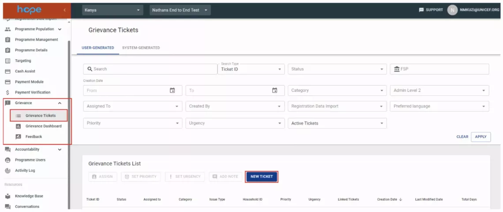
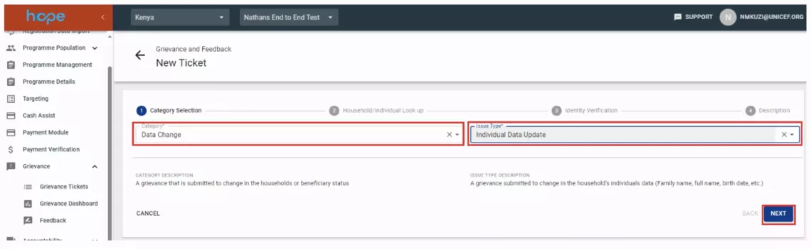

**title**: Programme Users 
**tags**:
    - Partner
    - Programme
    - Role

# User Management

The Program Users module shows the HOPE users in the Programme and which roles are assigned to them.

## How to view Programme Users

1. Select Programme users from the main menu. A list of the of all users in the Programme will be displayed include a search box with filters for the users. 
    

1. Click on the username to view details of roles assigned to a user. 
    
