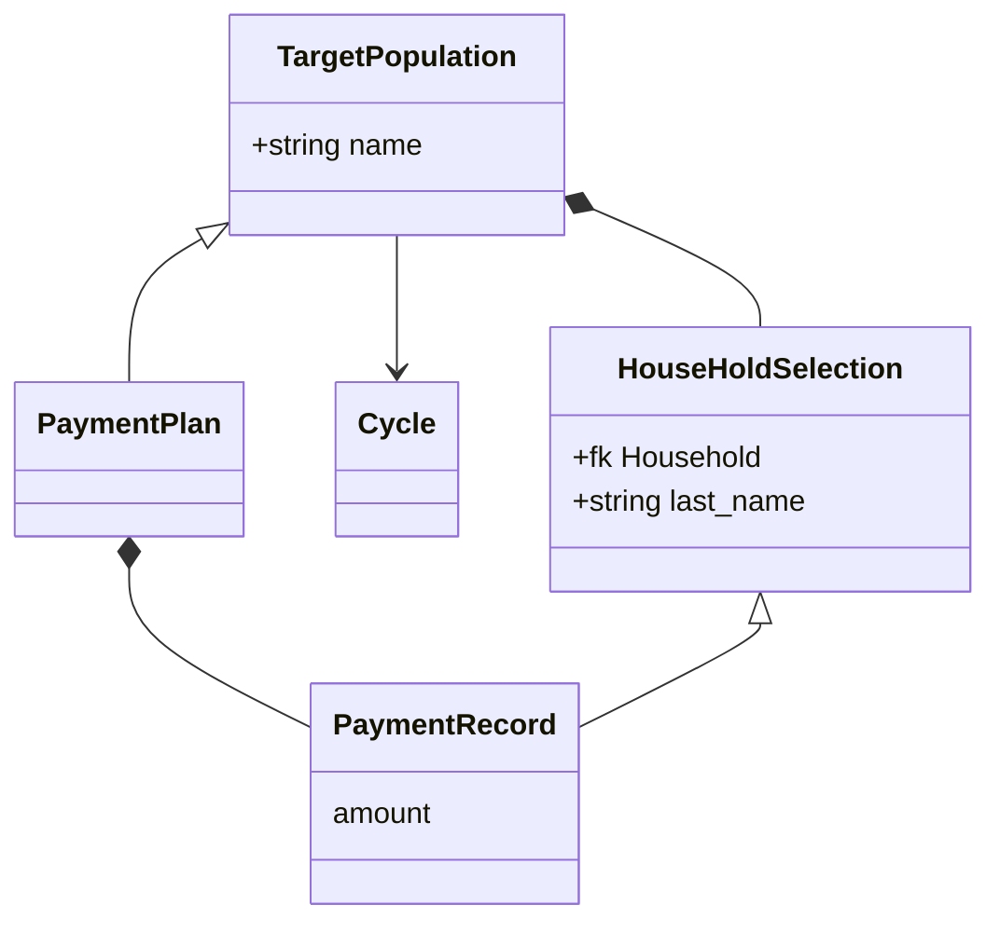
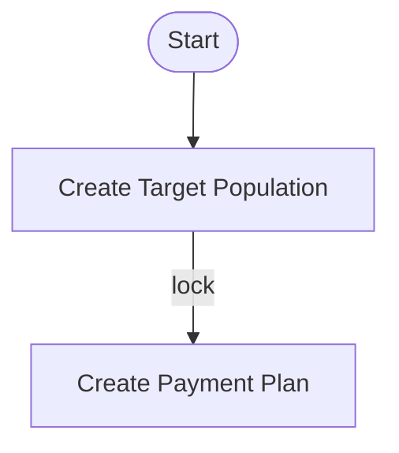

### Target Population

List of HHs candidate for a payment. TP can be promoted (locked) to become a [Payment Plan](#Payment Plan)

### HouseHold Selection
Alias of [Payment Record](#Payment Record) for Target Population

### Payment Plan
Locked Target Population ready to be processed 

### Payment Record
Single entry in TP/PP. It has many attributes filled during its lifecycle.

### Payment Instructions

### Payment List

!!! note
    
    - Target Population and Payment Plan is the same object in different phases of its life cycle
    - HouseHold Selection and Payment Record is the same object in different phases of its life cycle

### Trigger Event

